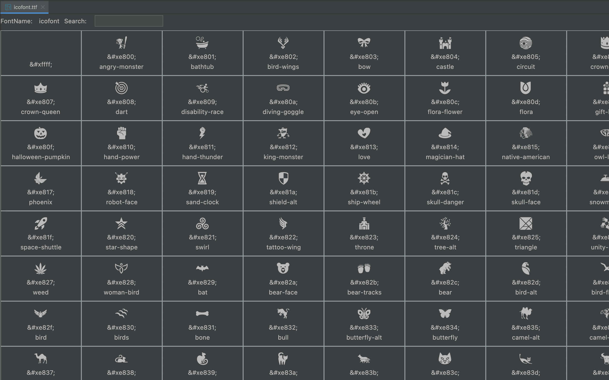
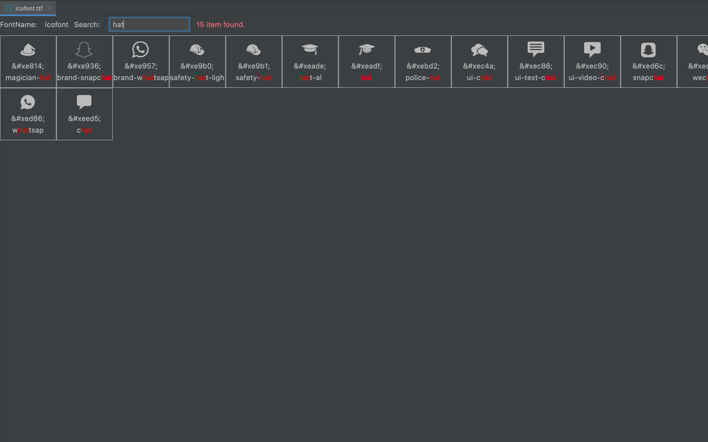

## Icon Font Viewer

> Display the icons (or symbols), characters, and Unicode code point information inside a TTF font file.

> 展示ttf字体文件内的icon(或者叫symbol)、字符以及unicode码点信息.
### preview

### installation
- It is available in *[Jetbrains Marketplace](https://plugins.jetbrains.com/plugin/19274-icon-font-viewer)* now, click hyperlink to get it, or search in your Intellij IDE - preferences(Settings) - plugins - marketplace by 'icon font viewer' to install.
- 此插件已上架Jetbrains插件商城，前往 *[Jetbrains Marketplace](https://plugins.jetbrains.com/plugin/19274-icon-font-viewer)* 下载, 或者打开你的Intellij IDE系软件 - preferences(Settings) - plugins - marketplace 搜索 'icon font viewer' 安装.
### usage
- open .ttf file to view.
- 打开.ttf文件查看.

### 捐赠
- 如果你觉得此项目对你有帮助, 你可以选择请我喝杯咖啡, 谢谢
- If you find this project helpful, you can buy me coffee! Thanks. (Alipay) 
